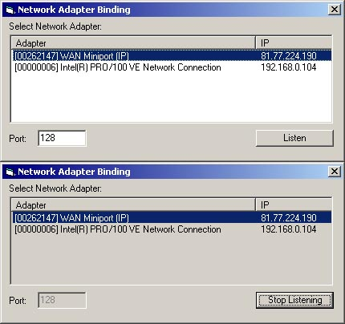



## Allow user to select network adapter to use from a list

### Description

This code demonstrates two things: firstly, it shows you how to get a list of network adapters, and secondly, it shows you how to bind to one of them that the user selects and connect through it. This is useful for users who have a separate internet and LAN connection, or two LAN connections, or whatever else. To test it, just run the program, and listen on a port and adapter, then type your IP followed by a colon and the port you selected into your browser's address bar and the program will return the headers the browser sent to the browser. Enjoy!
 
### More Info
 

             |
---                |---
**Submitted On**   |2005-10-18 13:30:08
**By**             |[William Keith](https://github.com/Planet-Source-Code/PSCIndex/blob/master/ByAuthor/william-keith.md)
**Level**          |Intermediate
**User Rating**    |5.0 (20 globes from 4 users)
**Compatibility**  |VB 6\.0
**Category**       |[Internet/ HTML](https://github.com/Planet-Source-Code/PSCIndex/blob/master/ByCategory/internet-html__1-34.md)
**World**          |[Visual Basic](https://github.com/Planet-Source-Code/PSCIndex/blob/master/ByWorld/visual-basic.md)
**Archive File**   |[Allow\_user19415010182005\.zip](https://github.com/Planet-Source-Code/william-keith-allow-user-to-select-network-adapter-to-use-from-a-list__1-62944/archive/master.zip)

